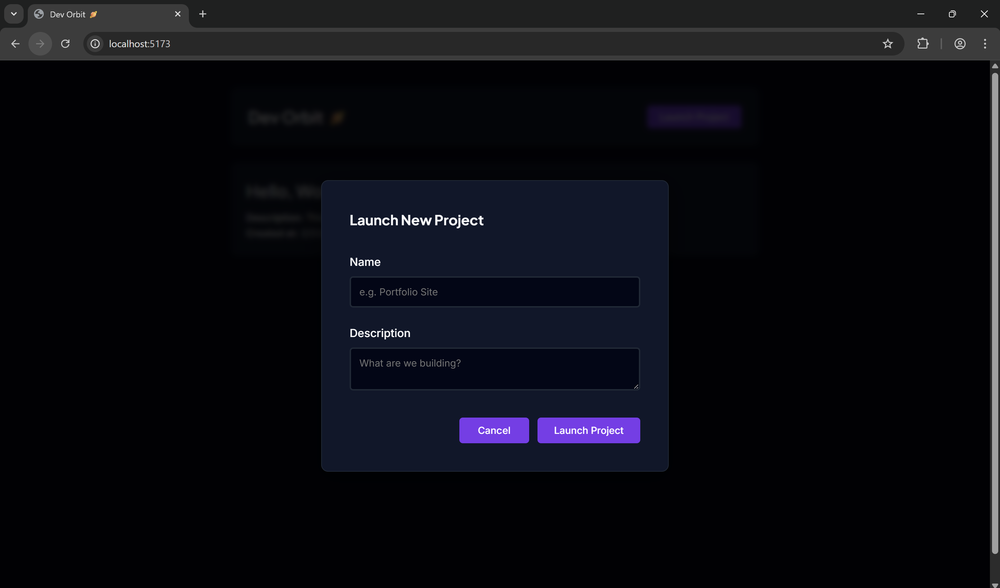
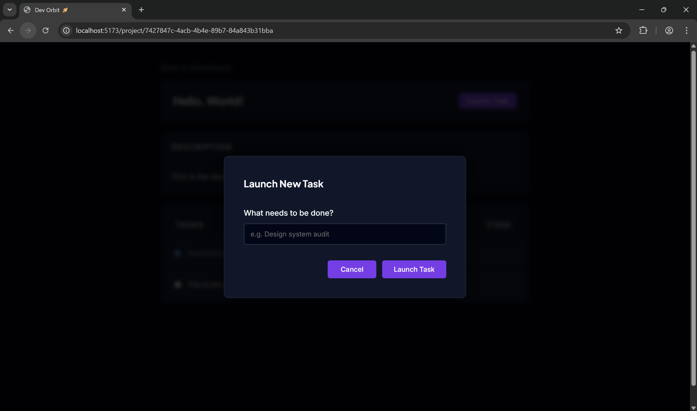

# Dev Orbit (Real-Time Developer Command Center)

Dev Orbit is a modern single-page application (SPA) designed for streamlined project and task management. It uses a FastAPI backend and a Vue 3 frontend, following a repository pattern for data handling and a "Deep Space" theme for a premium developer experience. The application provides real-time updates and an intuitive interface for developers to manage their projects efficiently.

## Features

- Asynchronous Backend: Built with FastAPI to handle concurrent API requests.
- Reactive Frontend: Vue 3 composition API for dynamic task and project updates.
- Project Hub: Dashboard for creating and deleting projects with persistent storage.
- Task Workspace: Individual project views with task completion toggles and description boxes.
- Custom UI: Dark-mode interface using Inter and Plus Jakarta Sans typography and a "Deep Space" theme for an immersive experience.

## Screenshots

### Project and Task Dashboards

### Project and Task Creation

